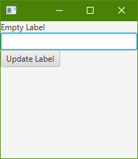
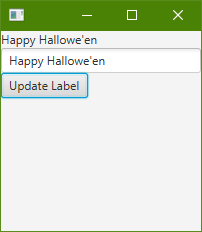
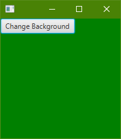
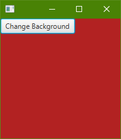

# Coding Questions 

Write the complete code application for the interface pictured below, using JavaFX (code, not FXML). Include code for creating and configuring the widgets, laying out the widgets in the window (as pictured), and linking the appropriate user events with the correct actions. You do not need to use an MVC architecture, and you do not need to necessarily get your code working 100% (see below). 

# Strategy

You are advised to write the complete code logic, even if there are errors. For example, if you do not remember specific names of widgets or methods, make up a term and comment your code to explain your functionality. If you provide complete logic, but your code does not work, then you can still receive full marks.  

# Coding Question 1

In the interface, pressing the “Update Label” button causes the contents of the TextField box to be put into the Label above it. You do not need to write any “include” statements or the “main” method. The default size of the window should be 200 pixels by 200 pixels. All code should be put in the provided Main class' start method.

 

# Coding Question 2

In the interface, pressing the update color button causes the color to change from the default green to red, clicking it again, will change it back to green; this will happen indefinitely. 

All code has been provided for the interface you need to complete the provided Controller class to enable this behaviour.

 

